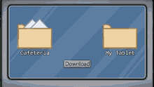

# UploadThings With UploadThing File Upload

<p align="center">
    <a href="#" style="display: block;" align="center">
        
    </a>
</p>


# Overview
<p align="center">
    <a href="#" style="display: block;" align="center">
        
    </a>
</p>

UploadThing is the easiest way to add file uploads to your full stack TypeScript application.
This project is a simple file upload implementation using **UploadThing**, **TypeScript**, and **Next.js**. 
It allows users to upload images with size restrictions.

## Tech Stack I used 🧑🏿‍💻.
- **Next.js** 15.2.2
- **React** 19.0.0
- **TypeScript** 5
- **UploadThing** 7.5.2

## Installation
### Prerequisites
Ensure you have **Node.js** and **npm** (or **pnpm/yarn**) installed.

### Steps
1. Clone the repository:
   ```sh
   git clone https://github.com/Lawani-EJ/ImageUploader
   cd ImageUploader
   ```

2. Install dependencies:
   ```sh
   npm install
   ```
   or using **pnpm**:
   ```sh
   pnpm install
   ```

3. Run the development server:
   ```sh
   npm run dev
   ```
   The app will be accessible at `http://localhost:3000`.

## Project Structure
```
📂 uploadthing-project
├── 📂 app
│   ├── 📂 components
│   │   ├── image-upload.tsx
│   ├── 📂 utils
│   │   ├── uploadthing.ts
│   ├── 📜 page.tsx
│   ├── 📜 layout.tsx
│   ├── 📜 globals.css
├── 📂 uploadthing
│   ├── 📜 core.ts
│   ├── 📜 route.ts
├── 📜 package.json
├── 📜 tsconfig.json
└── 📜 README.md
```

## Implementation Details
### `core.ts`
Defines the UploadThing file router with middleware for authentication and file upload constraints.

### `route.ts`
Creates API route handlers using UploadThing’s `createRouteHandler()` function.

### `image-upload.tsx`
A React component that utilizes the `UploadButton` from UploadThing to provide a user-friendly upload interface.

### `layout.tsx`
Sets up global styles and includes UploadThing's styles.

### `page.tsx`
Renders the `ImageUpload` component within a styled page.

## Usage
- Click the **Upload** button to select an image.
- The middleware ensures the user is authenticated before uploading.
- Uploaded files are logged in the console with metadata.

## Dependencies
```json
"dependencies": {
  "@uploadthing/react": "^7.3.0",
  "next": "15.2.2",
  "react": "^19.0.0",
  "react-dom": "^19.0.0",
  "uploadthing": "^7.5.2"
},
"devDependencies": {
  "@eslint/eslintrc": "^3",
  "@types/node": "^20",
  "@types/react": "^19",
  "@types/react-dom": "^19",
  "eslint": "^9",
  "eslint-config-next": "15.2.2",
  "typescript": "^5"
}
```
## Author
[Lawani-EJ](https://github.com/Lawani-EJ)

# Special Thanks

I would like to express my heartfelt gratitude to Cand Dev for the amazing tutorial on UploadThing. His guidance helped me understand and implement file uploads seamlessly in this project. Thank you for sharing your knowledge!


## License
This project is licensed under the **MIT License**.

